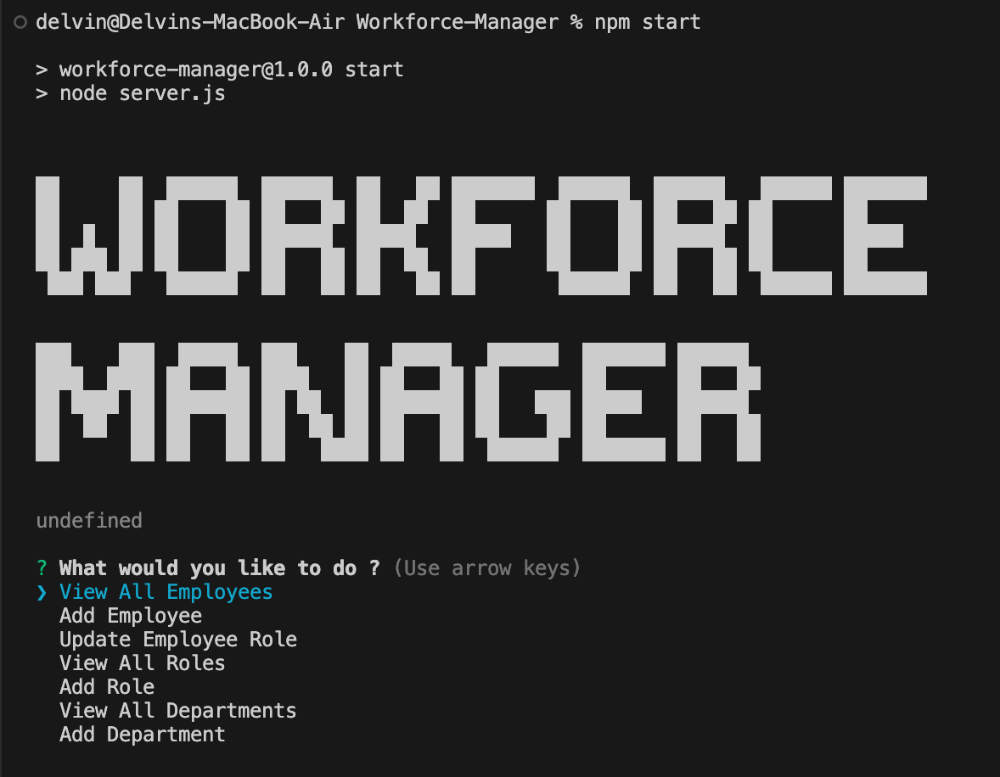
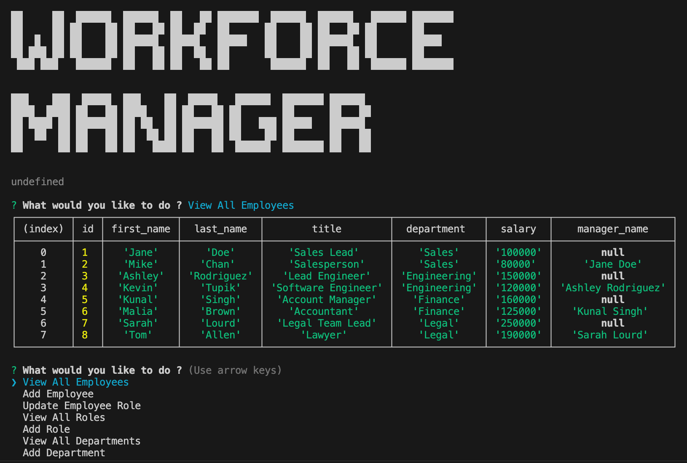

# Workforce-Manager

## Description

This ia a command line application used to manage the employee's, thier roles, departments and such.

## Table of Contents

* [Installation](#installation)

* [Usage](#usage)

* [Walkthrough](#walkthrough)

* [Credits](#credits)
  
* [License](#license)

* [Contributing](#contributing)

* [Questions](#questions)

## Installation

To install the necessary dependencies, run the following command:

npm i

## Usage 

Open the main folder in integrated terminal and install the dependencies. once done, You can use mysql to run schema.sql to set up the worforce_db and seeds.sql to populate it with sample data. Run server.js file using node server.js or npm start to start the application.

Once you run server.js you will be presented with "Workforce Manager" logo and "What would you like to do ?" question.

This is the main menu of the app. You can navigate up and down using arrow keys and select using enter key.

When you select a option respected changes will be shown in the command line.

Enjoy using the app !

## Walkthrough

Find below walkthrough video link:

https://drive.google.com/file/d/1r2F-Cjs-xD2B8tLn6d7C112l3cevgW-H/view?usp=sharing

## Credits

N/A

## License

This project is licensed under the MIT license.

## Contributing

Anyone is free to contribute

## Questions

If you have any questions about the repo, open an issue or contact me directly at write2delvin@gmail.com. You can find more of my work at [delve-in](http://github.com/delve-in/).

